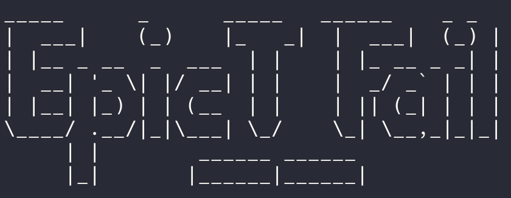
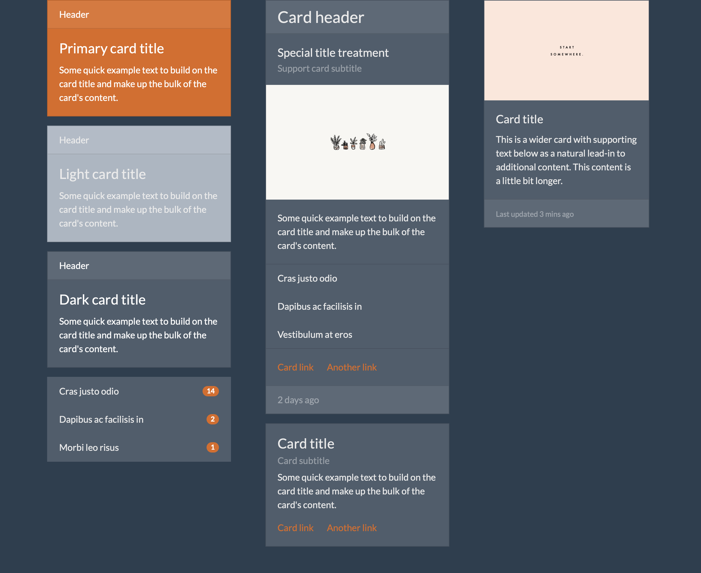

Projet : Molécules et organismes 

Par

     
Nous avons utilisé https://bootswatch.com/superhero/

Pour ce projet, nous allons te demander de partir sur un kit UI préfait. Ceci a deux avantages :

    Déjà, tous les atomes sont désignés. Les tables, les forms, les alertes et bien d'autres. Pas d'oubli et tu seras prêt à faire des molécules et organismes au top
    Ensuite, avec un kit UI déjà préfait, la mise en page sera beaucoup plus simple grâce au système de mise en page de Bootstrap

Ensuite, tu auras à réaliser les molécules et organismes suivants :

    Une navbar
    Un footer
    L'organisme "formulaire d'authentification"
    La bannière
    Plusieurs formats de cartes de présentation
        Puis les organismes qui représentent la listes de ces cartes
    La molécule commentaire
        L'organisme "section commentaires"
    Une section "présentation ressource" qui sera grossomodo la section qui présente le show de n'importe quelle ressource
    Une section qui présente un élément (à gauche du texte, à droite une image)
    Un organisme de ton choix

Enfin, pour ce projet, nous allons te demander de l'imaginer pour ton projet Eventbrite. En effet, demain tu insèreras toutes les molécules dans ton application lorsque nous te montrerons la force de l'atomic design conjugué à Rails.

Navbar :

Cards :

Bannière :

Formulaire :

Index :

